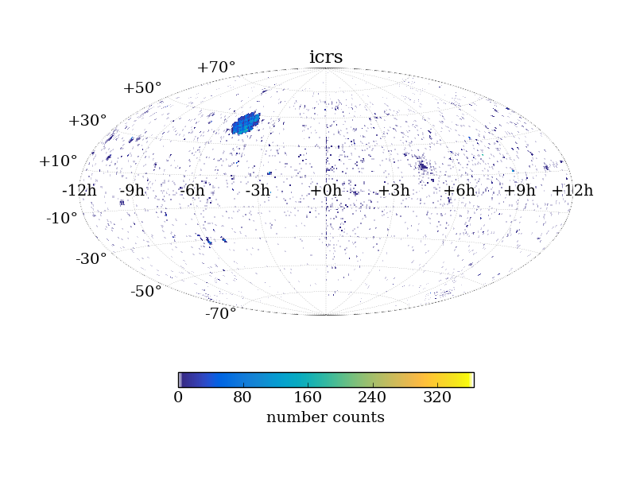
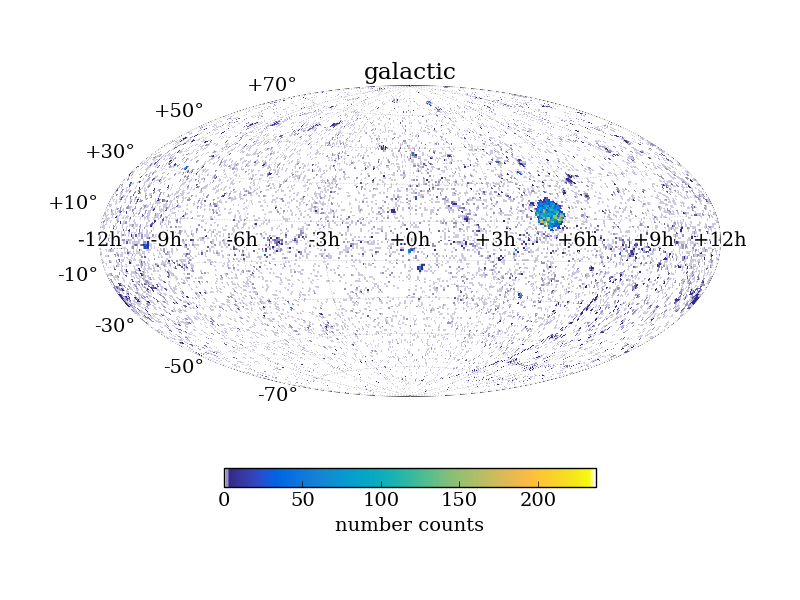

All-sky density mapping
=======================

This library implements a all-sky density map builder (C++) and plotter (Python).

Density mapper: `radec_density` 
-------------------------------

It allows one to create a density map by streaming data from an Ascii source or STDIN.
The streaming features helps reducing the memory footprint to almost nothing
even when dealing with large amount of data. Only the density map is fully in
memory during the computations (< 1M).
The code allows transformation on the fly such as converting inputs in radians
to degrees (`--radians` option) or sky coordinate transformation (`--transform`
option).

For speed reasons, this code is made in C++ (using C++11 features) and do not
require external libraries that standard ones. 

Tested with gcc 4.8.4 (ubuntu), gcc 5.3 and clang 7.

to compile the code, run: `> make`

.. code::

	> ./radec_density -h

-h, --help          Display help message
-i, --input         input data file
-o, --output        output histogram to file
-c, --columns       column indexes to use (RA, DEC [,Weight]) (starts at 0)
--dra           RA bin width in degrees
--ddec          RA bin width in degrees
-t, --transform     coordinate transformation
--comment       comment line character in input file
-d, --delim         delimiter character in input file
-r, --radians       set if input ra,dec are in radians

Available transformations
~~~~~~~~~~~~~~~~~~~~~~~~~

Using the internal coordinates library, you can transform one set of coordinates
into another system. Available transformations are:

+----------+----------+----------+
|  name    |   from   |    to    |
+==========+==========+==========+
| GAL2ICRS | galactic | ICRS     |
+----------+----------+----------+
| ICRS2GAL | ICRS     | galactic |
+----------+----------+----------+ 
| ECL2ICRS | ecliptic | ICRS     |
+----------+----------+----------+
| ICRS2ECL | ICRS     | ecliptic |
+----------+----------+----------+
| GAL2ECL  | galactic | ecliptic |
+----------+----------+----------+
| ECL2GAL  | ecliptic | galactic |
+----------+----------+----------+
 
Transformations are based on
     Hipparcos Explanatory Vol 1 section 1.5
     Murray, 1983, section 10.2
     van Altena et al. 2012, Chapter 4.5 of "Astrometry for Astrophysics"
 
Galactic pole coordinates are based on J2000 values.

Output file
~~~~~~~~~~~
 
The output file of the code is a plain Ascii array (image) 

the axis ranges span the all-sky 
	x := [-180, 180] and y:= [-90, 90]
with angular pixel sizes given by 
	dx := 360. / float(nx) and  dy := 180. / float(ny)

The plotting code (`plot.py`) knows already what to do with it.

Plot density map: `plot.py`
---------------------------

This python code generates a map from the outputs of `radec_density`. The
projection can be defined based on what is available in `mpl_toolkits.basemap`.

requires `mpl_toolkits.basemap`

.. code:: 

	> ./plot.py -h

-h, --help            show this help message and exit
--title=TITLE         Figure title
-o FIGOUT, --output=FIGOUT
		export figures using this suffixe
-q, --quiet           set to skip showing the figures
--projection=PROJECTION
			MAP Coordinate projection base

Examples
--------

Sample catalog file is included in the repository

.. code::

	> ./radec_density -i sample.cat -o sample_icrs.hist --dra 1 --ddec 1
	> ./plot.py sample_icrs.hist --title icrs -o sample_icrs.png
	> ./radec_density -i sample.cat -o sample_gal.hist --dra 1 --ddec 1 -t ICRS2GAL
	> ./plot.py sample_gal.hist --title galactic -o sample_gal.png

